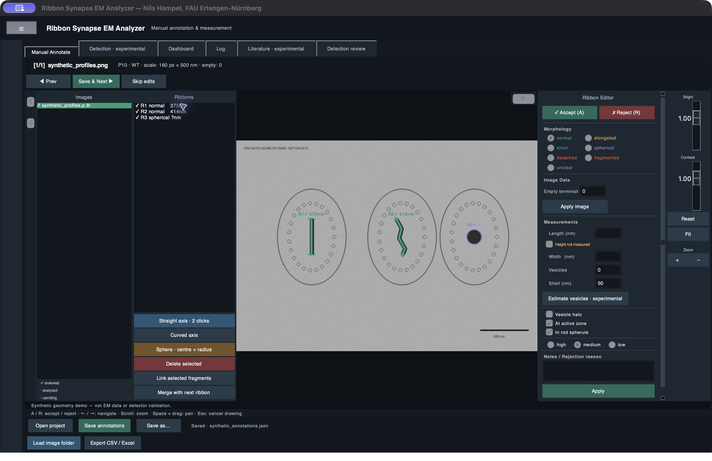

# Ribbon Analyzer

[](https://github.com/nils2511/ribbon-analyzer-desktop/actions/workflows/tests.yml)

A desktop workspace for **manual annotation and measurement of synaptic ribbon profiles in electron micrographs**. Load an image folder, trace straight or curved axes, mark spherical profiles and keep classifications, measurements and notes together in a saved project.

I developed Ribbon Analyzer with assistance from Claude Code during my neuroscience master's thesis at FAU Erlangen-Nürnberg. It supported the manual analysis of ribbon morphology in mouse rod photoreceptors during postnatal development. The annotations used in the thesis were made by hand.



*The screenshot uses synthetic geometry. No research micrographs or thesis annotations are included.*

## What you can do

| Feature | Workflow |
| --- | --- |
| Browse images | Load TIFF, PNG, JPEG or BMP images from a folder and its subfolders |
| Annotate profiles | Draw straight axes, curved axes or spherical profiles; select, edit, accept, reject or delete annotations |
| Record morphology | Classify profiles, link fragments and record whether height was measured |
| Measure | Calibrate against the image scale bar; record lengths and widths in nm |
| Count empty terminals | Record image-level counts independently of ribbon measurements |
| Save and resume | Save projects as JSON, reopen them and locate their images again if the image folder has moved |
| Export | Create CSV tables, an Excel workbook, a text report and exploratory plots |

**Manual annotation works locally without an API key or an internet connection after installation.** The app does not make API calls on startup.

## Install and run

Use Python **3.10 or later**, with Tkinter/Tcl-Tk support.

**macOS / Linux**

```bash
bash setup.sh
bash start.sh
```

**Windows**

Run `setup_windows.bat`, then `start.bat`. Both scripts resolve paths relative to the application folder.

Alternatively, create a virtual environment, install `requirements.txt`, then run:

```bash
python ribbon_analyzer.py
```

On Debian/Ubuntu, Tkinter and venv may need to be installed first:

```bash
sudo apt install python3-tk python3-venv
```

## Try the synthetic demo

```bash
python ribbon_analyzer.py --demo
```

This creates a small synthetic image and a saved example project in `demo_output/`, then opens the manual annotation tab. It demonstrates the controls and file format; it is not an electron micrograph or a validation dataset. Existing demo annotations are preserved when you launch it again.

## Manual workflow

1. Select **Load image folder**, or **Open project** to resume a saved JSON project.
2. Before loading new images, set the scale calibration in Project Setup. `319 px = 500 nm` is a default example, not a universal calibration.
3. Choose a drawing tool, place its points and edit the annotation in the Ribbon Editor. For curved axes, left-click to place points, right-click to finish the axis, then set the width and confirm. Use **Height not measured** when the profile should be counted without a height measurement.
4. Record empty terminals if needed. Use **Save annotations** for a disk save; **Save & Next** saves the project before navigating. **Skip edits** discards the current image's uncommitted ribbon edits.
5. Use **Export CSV / Excel** for tables, a report and plots. Exporting results does not replace saving the annotation project.

If image files are missing when you reopen a project, the app offers to select their new root folder. It preserves relative folder structure and will not guess between ambiguous duplicate filenames. Missing-image annotations remain in the project.

See [the usage guide](docs/USAGE.md) for shortcuts and measurement details.

## Experimental detection and literature tools

The local detector and optional Anthropic-assisted detection are **experimental**. They can miss ribbons and produce false positives. They require manual review and were not used to generate the thesis annotations automatically. The vesicle estimate is experimental too.

Anthropic features require your own API key, entered in the optional key field or supplied through `ANTHROPIC_API_KEY`. The app does not write that key into projects or source files. AI image analysis sends resized images, age/genotype context, local candidate information, literature context and summaries of local review examples to Anthropic. Literature actions send research queries and generated text. These actions are user-triggered and may incur API charges. Verify literature statements against the original papers.

## Measurements and interpretation

The app stores calibration per image and measurements in nm. Spherical profiles can be classified and counted with height left unmeasured. The existing morphology labels are retained for project compatibility; `normal` was used for plate-shaped profiles in the thesis workflow.

Saved measurements are loaded as recorded. New manual measurements use the actual horizontal and vertical pixel dimensions, including rectangular images, and convert µm calibration to nm. No study-specific correction is applied automatically. In particular, the thesis's 50 nm height offset was a separate analysis step.

Exports describe annotated profiles and image-level counts. They do not encode biological replicate identifiers or reproduce the thesis's per-animal statistical analysis. The plots are exploratory summaries, not a substitute for an appropriate statistical analysis.

## Development

```bash
python -m unittest discover -s tests -v
python scripts/check_release.py
```

GUI tests require a display. On Linux, they can run with `xvfb-run -a`. The release check examines staged files and reachable Git history without printing credential values. [Release notes](docs/RELEASE.md) describe the publication boundaries and compatibility changes.

The repository contains source, documentation, tests and a synthetic demo generator. Real images, saved research projects, review examples, exports, local settings and backups remain outside its publication allowlist.

See [CONTRIBUTING.md](CONTRIBUTING.md) for bug reports and development expectations, [SECURITY.md](SECURITY.md) for private vulnerability reports and [CITATION.cff](CITATION.cff) for software attribution. [Repository preparation notes](docs/REPOSITORY.md) record the remaining GitHub settings and licence decision.

## Licence

Copyright © 2026 Nils Hampel. Released under the [MIT licence](LICENSE). You may use, modify and redistribute the software, including commercially, provided the copyright and licence notices are retained.
